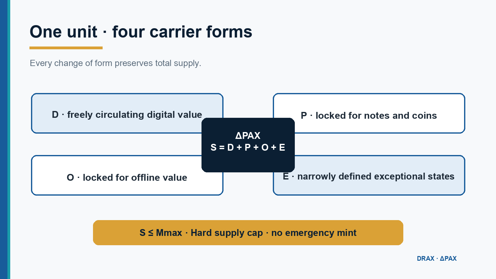

# Architecture · Architektur · Αρχιτεκτονική

The DRX research architecture is documented in three languages:

- [Deutsch — vollständige Architektur](docs/de/architecture.md)
- [English — complete architecture](docs/en/architecture.md)
- [Ελληνικά — πλήρης αρχιτεκτονική](docs/el/architecture.md)

## Canonical invariant

```text
S = D + P + O + E ≤ Mmax
```

The invariant means that digital circulation, physical cash locks, offline locks and exceptional states are parts of one supply. Moving value between forms must never increase `S`.


