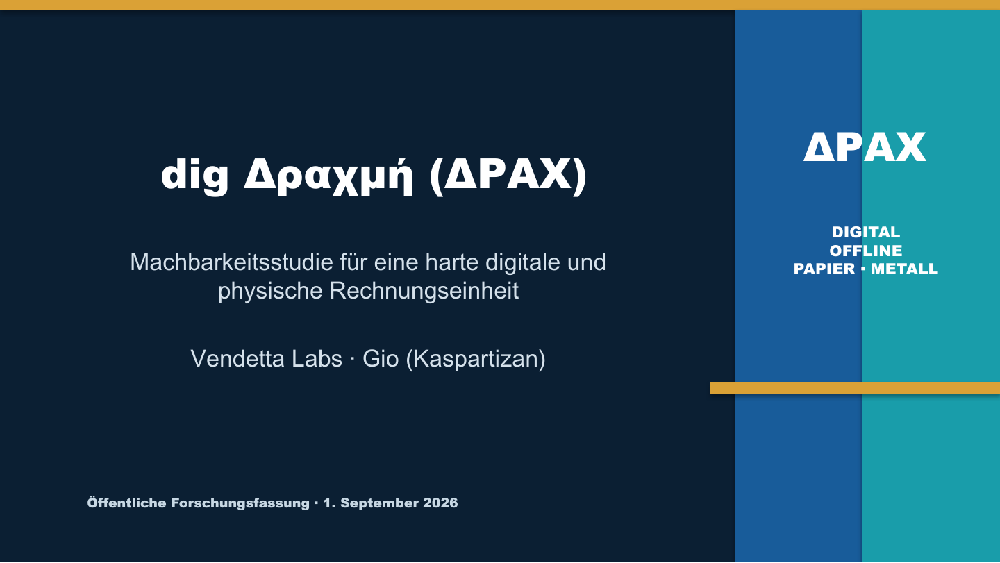

# dig Δραχμή · ΔΡΑΧ · DRAX

**Public feasibility study for a hard digital, offline-capable and physical national currency.**

**Öffentliche Machbarkeitsstudie für eine harte digitale, offline-fähige und physische Landeswährung.**

**Δημόσια μελέτη σκοπιμότητας για ένα σκληρό ψηφιακό, offline και φυσικό εθνικό νόμισμα.**

[Deutsch](https://neabouli.github.io/DRAX/de/) · [English](https://neabouli.github.io/DRAX/en/) · [Ελληνικά](https://neabouli.github.io/DRAX/el/) · [Project website](https://neabouli.github.io/DRAX/)



> **Status — 1 September 2026:** This is an independent public research project by Vendetta Labs. It is not commissioned, approved or endorsed by the Greek government, the Bank of Greece, the European Central Bank or Kaspa. ΔΡΑΧ is not legal tender, not a live asset, not an investment product and not available for purchase.

## The idea in one sentence

One monetary unit should be able to circulate as self-custodied digital bearer value, prefunded offline value, banknotes and coins without creating four separate money supplies.

```text
S = D + P + O + E ≤ Mmax
```

- `D`: freely circulating digital value
- `P`: value locked for physical notes and coins
- `O`: value locked for bounded offline use
- `E`: narrowly defined exceptional states
- `Mmax`: immutable maximum supply proposed for study

Changing form must not create money. A physical note worth `x ΔΡΑΧ` may exist only while exactly `x ΔΡΑΧ` remains locked in a publicly auditable `CashLot`.

## What is published here

- a trilingual plain-language explanation;
- the monetary and Kaspa Toccata architecture;
- the CashLot bridge between digital value, banknotes and coins;
- the Genesis Steward sunset and public key-burn model;
- Eurozone legal boundaries and a separate monetary-sovereignty scenario;
- Phase-0 plan, budget bands, milestones and stop criteria;
- an honest risk register;
- the complete German public research dossier, decision memo, ministry submission template and presentation;
- all presentation slides as browser-readable images.

## What is deliberately not here

No protocol code, smart contracts, wallets, token sale, deployable binaries, mainnet addresses, private keys or claims of government approval are included. Phase 0 proposes only legal research, economic simulation, laboratory work and a valueless testnet prototype.

## Start reading

| Deutsch | English | Ελληνικά |
|---|---|---|
| [Überblick](docs/de/index.md) | [Overview](docs/en/index.md) | [Επισκόπηση](docs/el/index.md) |
| [Architektur](docs/de/architecture.md) | [Architecture](docs/en/architecture.md) | [Αρχιτεκτονική](docs/el/architecture.md) |
| [Dossier](docs/de/dossier.md) | [Dossier guide](docs/en/dossier.md) | [Οδηγός φακέλου](docs/el/dossier.md) |
| [Recht & Governance](docs/de/law-governance.md) | [Law & governance](docs/en/law-governance.md) | [Νομικό πλαίσιο & διακυβέρνηση](docs/el/law-governance.md) |
| [Phase 0 & Risiken](docs/de/phase-0-risks.md) | [Phase 0 & risks](docs/en/phase-0-risks.md) | [Φάση 0 & κίνδυνοι](docs/el/phase-0-risks.md) |
| [Folien & Downloads](docs/de/slides.md) | [Slides & downloads](docs/en/slides.md) | [Διαφάνειες & λήψεις](docs/el/slides.md) |

The German dossier is the canonical Version 0.9 source. English and Greek web pages are explanatory translations. Greek legal terminology remains subject to review by qualified Greek counsel.

## Licence

Text and original diagrams are released under [CC BY-SA 4.0](LICENSE.md). Names, marks and third-party materials retain their respective rights.
